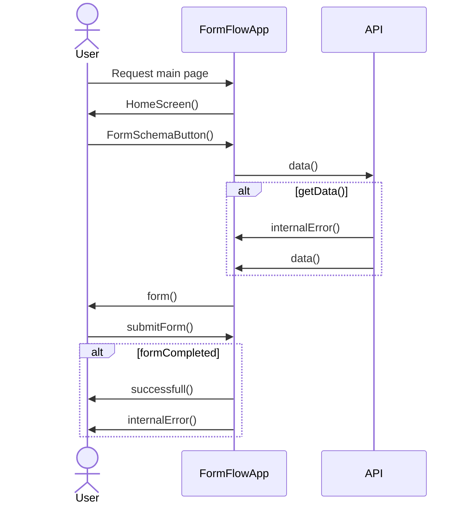
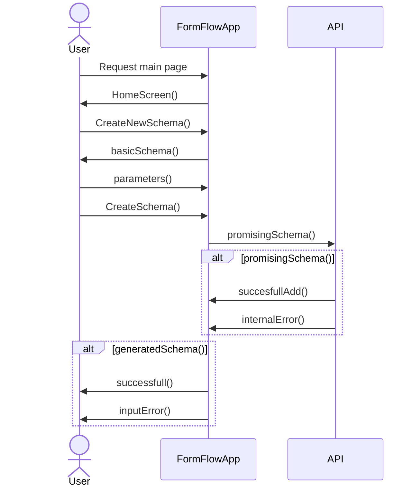
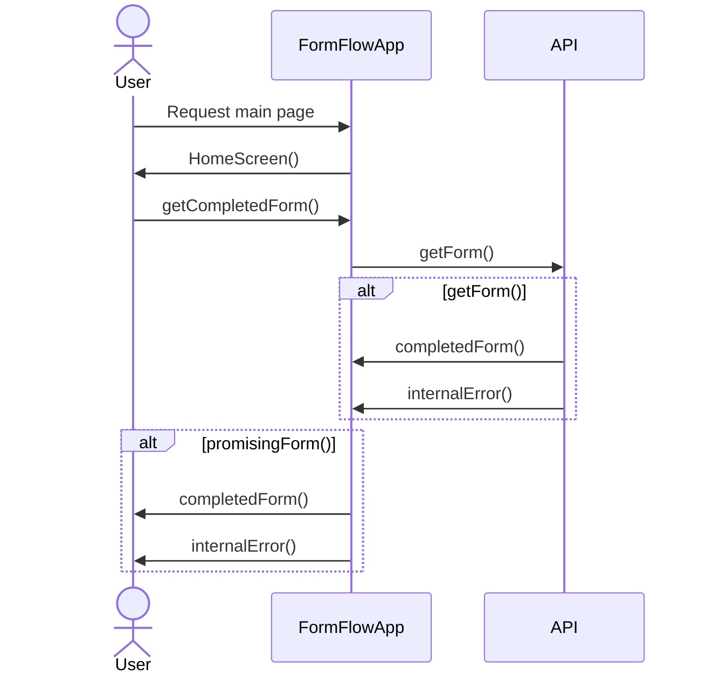

<!--
SPDX-License-Identifier: LICENSE.md
-->

# DISEÑO

# FILL A FORM

```mermaid

sequenceDiagram
    actor User
    User->>  FormFlowApp: Request main page
    FormFlowApp->> User: HomeScreen()
    User->> FormFlowApp: FormSchemaButton()
    FormFlowApp->> API: data()
    alt getData()
      API->> FormFlowApp: internalError()    
      API->> FormFlowApp: data()
    end
    FormFlowApp->> User: form()
    User->> FormFlowApp: submitForm()
    alt formCompleted
      FormFlowApp->> User: successfull()
      FormFlowApp->> User: internalError()
    end

```
# CREATE A FORM

```mermaid

sequenceDiagram
    actor User
    User->>  FormFlowApp: Request main page
    FormFlowApp->> User: HomeScreen()
    User->> FormFlowApp: CreateNewSchema()
    FormFlowApp->> User: basicSchema()
    User->> FormFlowApp: parameters()
    User->> FormFlowApp: CreateSchema()
    FormFlowApp->> API: promisingSchema()
    alt promisingSchema()
      API->> FormFlowApp: succesfullAdd()
      API->> FormFlowApp: internalError()
    end
    alt  generatedSchema()
        FormFlowApp->> User: successfull()
        FormFlowApp->> User: inputError()
    end

```

# READ A FILLED FORM

```mermaid

sequenceDiagram
    actor User
    User->>  FormFlowApp: Request main page
    FormFlowApp->> User: HomeScreen()
    User->> FormFlowApp: getCompletedForm()
    FormFlowApp->> API: getForm()
    alt getForm()
      API->> FormFlowApp: completedForm()
      API->> FormFlowApp: internalError()
    end
    alt  promisingForm()
      FormFlowApp->> User: completedForm()
      FormFlowApp->> User: internalError()
    end

```
